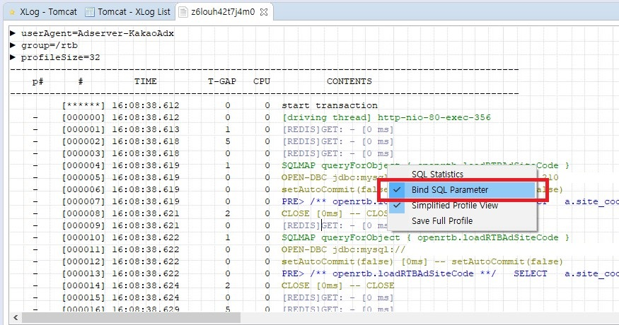

ScouterLogParser
================

myBatisLogParser -> scouter 출력 log로 변경

Before :
 Copy & Paste scouter log ;
 ```scouter
 ------------------------------------------------------------------------------------------
     p#      #    	  TIME         T-GAP   CPU          CONTENTS
 ------------------------------------------------------------------------------------------
          [******] 13:38:46.438        0      0  start transaction
     -    [000000] 13:38:46.438        0      0  [driving thread] http-apr-80-exec-81
     -    [000001] 13:38:46.439        1      0  SQLMAP queryForObject { rtbShop.selMobileShopData }
     -    [000002] 13:38:46.439        0      0  PRE> /* test */ SELECTTEST1, TEST2 FROM DUAL   WHERE   TEST1='@{1}'   AND TEST2='@{2}'   AND TEST3=?  
                                                 ['Y','Y','A229XX00132','A'] 1 ms
          [******] 13:38:46.942      503      2  end of transaction
 ------------------------------------------------------------------------------------------

```
위의 scouter log에서
```

    -    [000002] 13:38:46.439        0      0  PRE> /* test */ SELECTTEST1, TEST2 FROM DUAL   WHERE   TEST1='@{1}'   AND TEST2='@{2}'   AND TEST3=?  
                                                ['Y','Y','A229XX00132','A'] 1 ms
------------------------------------------------------------------------------------------

```
위 내용만 복사하여 사용

After :
```sql
SELECT TEST1, TEST2 FROM DUAL WHERE COL1 = 'CW' AND COL2 = '9999'
````

진짜 오랜만에 tipJS를 보면서 신기했습니다.  

- scouter 에서 "/" 나누기가 안보이는 현상이 있는데, scouter 를 fork 떠서 source를 봐도 문제는 없어 보여, 우선 해당 구분을 강제로 "/"를 넣도록 하드코딩 처리했습니다.  
- scouter version 이 되면서 해당 버그가 수정이 되어, 해당 부분 원복했습니다.

2019-04-22


scouter 의 경우 Bind SQL parameter 를 통해 파라미터가 자동으로 바인딩 처리되는 것을 확인했습니다.
